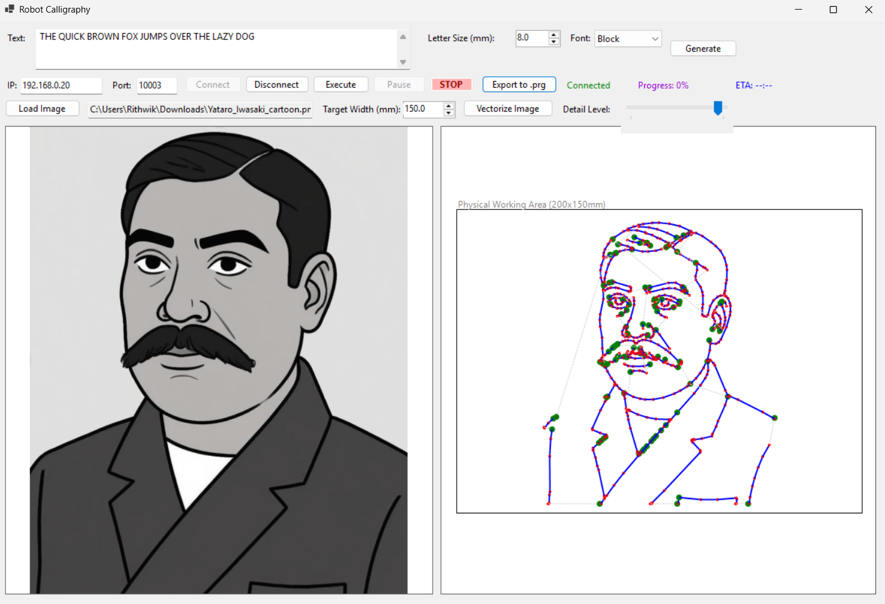
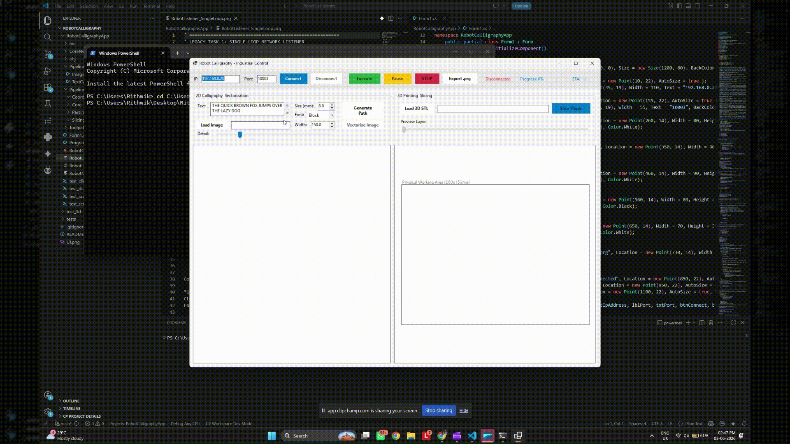

# 6-DOF Robotic Calligraphy & 3D Printing

  

WIP C# WinForms app for real-time calligraphy & 3D printing via Mitsubishi RV-8CRL-D & CR800. Streams live coordinates over TCP using an asynchronous lookahead buffer to achieve perfectly fluid continuous path interpolation (no pre-programmed waypoints).

---

## 📸 Showcase

**Application UI**

**3D Printing Demo**

---

## 🚀 Architecture
Uses **Strategy Pattern** for scalable, decoupled 2D & 3D pipelines.

- **`ToolpathEngine`**: `IToolpathGenerator` enforces waypoints. `ToolpathCoordinator` manages active pipeline.
- **Pipelines**:
  - `ImageVectorizationPipeline2D`: Emgu.CV thinning, compression, path optimization.
  - `TextCalligraphyPipeline2D`: Font generation, text wrap.
  - `PrusaSlicerStrategy` (3D): Headless PrusaSlicer CLI execution with auto-support generation and toolpath decimation.
  - `GCodeParser` (3D): Parses G-Code to 6DOF waypoints (X,Y,Z, Posture).
- **Networking (`RobotTcpClient`)**: Highly optimized asynchronous TCP stream. Implements a 50-point `SemaphoreSlim` lookahead buffer that seamlessly feeds the robot's internal hardware queue, completely eliminating motion stuttering.

---

## ✨ Key Features

- **🧊 3D Printing**: Headless slicing (`prusa-slicer-console.exe`) with automatic breakaway support generation and adaptive G-Code resolution (decimation) for flawless robotic execution. Includes auto-centering, interactive 3D orbit viewer, and layer debugger.
- **🖋️ Typography**: 3 fonts (Block, Rounded, Italic), multi-line wrap, auto-justification.
- **🖼️ Image Vectorization**: Emgu.CV raster-to-vector, Ramer-Douglas-Peucker compression, nearest-neighbor sorting, auto-scaling.
- **⚡ Control**: Zero-latency streaming, Continuous Path Interpolation (`CNT 1`), intelligent TCP garbage collection, and instant Pause/Stop commands.

---

## 🔌 Setup & Hardware

- **Hardware**: Ethernet laptop → CR800 controller.
- **Network**: Robot IP `192.168.0.20`, Laptop IP `192.168.0.100` (subnet `255.255.255.0`).
- **PrusaSlicer**: Ensure `prusa-slicer-console.exe` is in PATH or the default installation directory.

---

## 🛠️ RT ToolBox3 Config

1. **OPT12 (Ethernet Data Link)**: Mode `1: Server`, Port `10003`, Protocol `0: No-procedure`, Packet Type `0: CR`.
2. **CPRCE12**: Set to `2` (Data Link mode). ⚠️ CRITICAL
3. **COMDEV(2)**: Map to `OPT12`.
4. **Power Cycle**: OFF → wait 5 sec → ON.
5. **Load PRG**: Write `RobotListener_Smooth.prg` to controller.

---

## 🧪 Testing

1. Run `RobotListener_Smooth.prg` on the robot controller (Slot 1).
2. `dotnet run --project RobotCalligraphyApp.csproj`.
3. Connect to IP `192.168.0.20`, Port `10003`.
4. Select 2D (Image/Text) or 3D (STL).
5. Click **Execute** to stream.

---

## 🔮 Next Steps
- E-axis velocity control mapping.
- G-Code Arc (G2/G3) support.
- Auto mesh repair.
